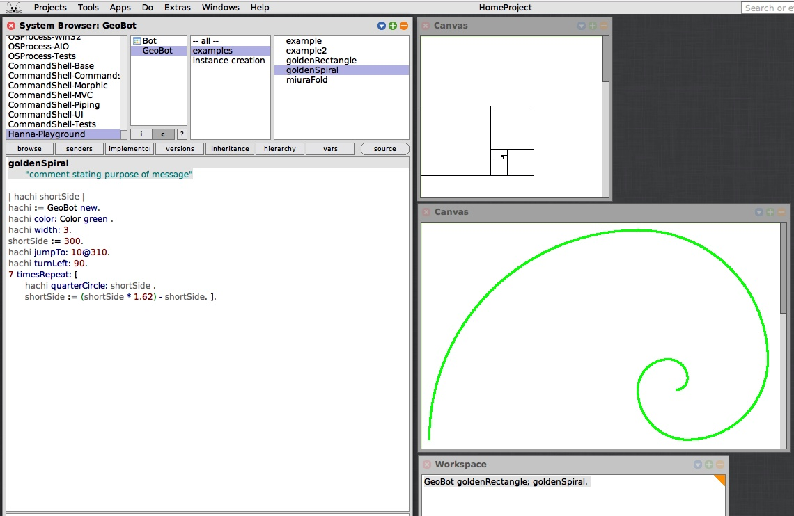
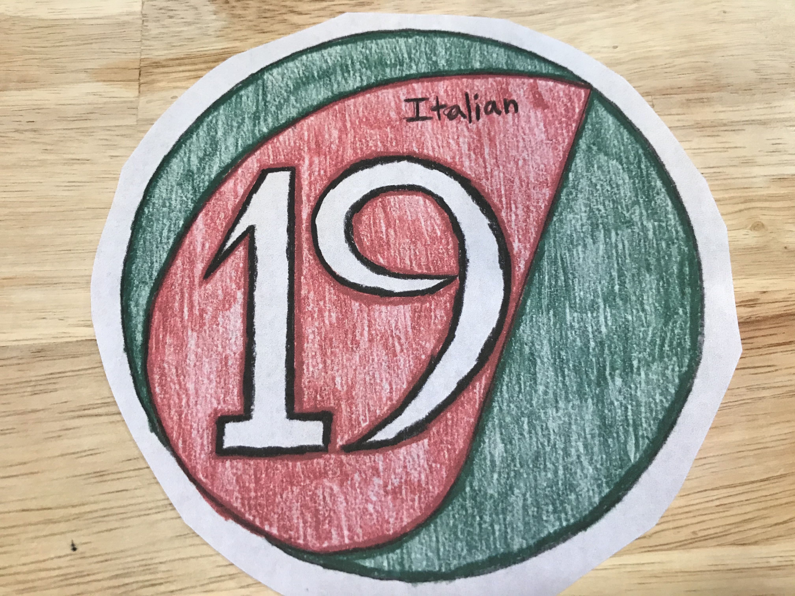
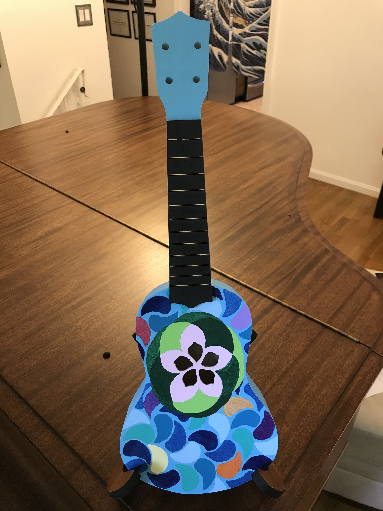

# Golden ratio, golden rectangles and golden circles

This is a [Squeak Smalltalk](https://squeak.org/) implementation of simple algorithms to draw golden rectangles and golden circles. They follow the [golden ratio](https://en.wikipedia.org/wiki/Golden_ratio), which is known as 1 : 1.62 or 5 : 8. 

  

The golden ratio has been used in architecture, art (Mona Lisa, for example), grahical design (including logo design and web page design), product design (such as dimensional ratio for TVs, computer screens and credit cards) and many other areas. Using various curves made with the golden ratio, I created a logo for my own business, designed and built a ukulele, and painted [Hokusai](https://en.wikipedia.org/wiki/Hokusai)'s ["The Great Wave"](https://en.wikipedia.org/wiki/The_Great_Wave_off_Kanagawa). 

  
   
  

This code base is pushed to GitHub with Squeak's Git Browser ([Squot](https://github.com/hpi-swa/Squot)). It has been tested with Squeak 3.4 and 3.5. The GeoBot class is implemented by customizing a class that is covered in Stephane Ducasse's awesome book ["Squeak: Learn Programming with Robots"](https://smile.amazon.com/Squeak-Programming-Robots-Technology-Action/dp/1590594916/).

I wrote this code in August 2020 to work on a summer research project about the golden ratio. See a [research report](https://drive.google.com/file/d/1aJgUu42q626hH9AvrM_HHyUy8is_DSw9/view?usp=sharing), written in Japanese, if you can read Japanese. :smile: 
